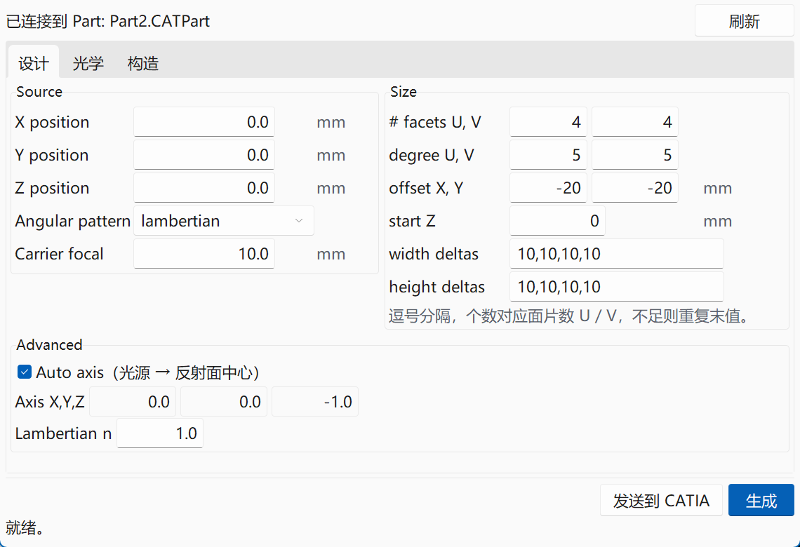
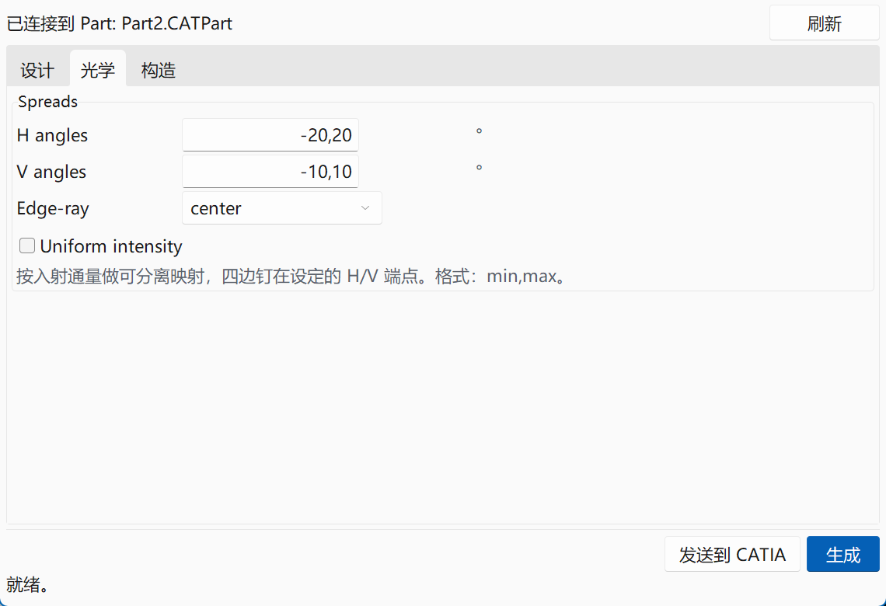
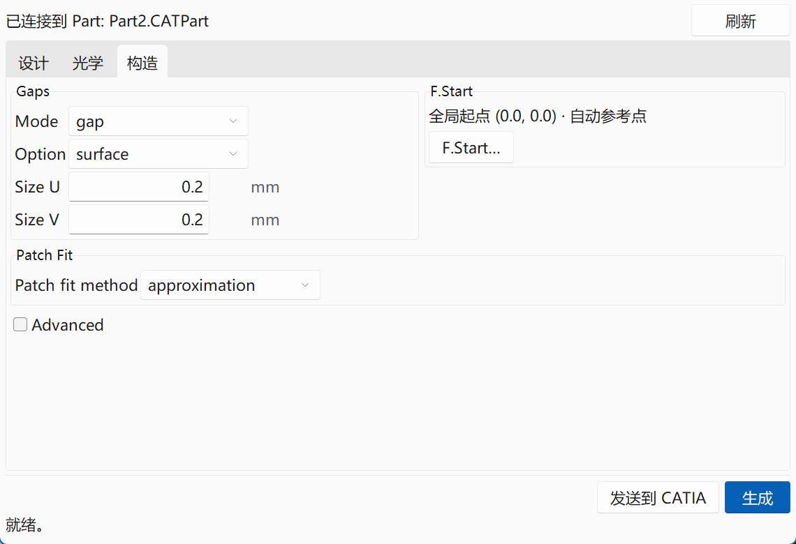

# RefLab

**RefLab**（Reflector Lab，反射器实验室）是一款开源的面片反射镜设计工具，采用 LucidShape MF（MacroFocal）风格的逐面片光学求解流程：输入光源位置、面片网格与远场角度分布，程序依据反射定律为每个面片独立求解高度场，拟合成真正的 NURBS 曲面，并可无缝导出为 STEP / STL / OBJ，或直接发送到正在运行的 CATIA V5 会话。



## 功能特性

- **逐面片光学求解**：每个面片依据反射定律独立积分求解高度场，支持水平/垂直优先的求解顺序与自定义计算起点（F.Start）
- **远场角度分布**：每个面片的 H/V 角度列表支持线性分布与分段插值（`-20,20`、`0,5,10,15,20` 均可）
- **均匀光强模式**：按入射通量做可分离能量映射，使远场矩形内光强均匀
- **缝隙系统**：gap / no-gap / step-back 三种模式，缝隙面自动生成，保证相邻面片间的几何连贯
- **邻边基线**：可选的共享边曲线匹配，使整族面片在水密（C0）边界处无缝衔接
- **真实 NURBS 输出**：每片面片拟合为 B 样条曲面，STEP 导出时全部光学面与缝隙面缝合成单一 Shell
- **CATIA 直连**：自动检测运行中的 CATIA V5 会话，一键将结果导入当前激活的 Part
- **现代界面**：亮色主题、高分屏 DPI 适配、大网格后台生成不冻结界面

| 设计页（光源与孔径） | 光学页（远场分布） | 构造页（缝隙与求解器） |
|:---:|:---:|:---:|
|  |  |  |

## 光学原理

想了解求解器内部如何工作（载体抛物面、反射定律法线、最小二乘高度重建、能量映射、缝隙缝合等），请阅读 [`docs/optics_principles.html`](docs/optics_principles.html)。

## 环境要求

- Windows 10/11（CATIA 集成为 COM 接口，仅限 Windows；导出 STL/OBJ 功能无平台限制）
- Python 3.9+
- 可选：CATIA V5（仅「发送到 CATIA」功能需要）

## 安装

```bash
git clone https://github.com/FeifeiWang920/RefLab.git
cd RefLab

# 建议使用虚拟环境
python -m venv .venv
.venv\Scripts\activate          # Windows
# source .venv/bin/activate     # Linux/macOS（仅 STL/OBJ 导出可用）

pip install -r requirements.txt
```

> `cadquery` 依赖体积较大（含 OpenCascade），仅 STEP 精确导出需要。若只需要 STL/OBJ 网格导出，可先安装 `numpy numba sv-ttk` 运行。

## 快速开始

```bash
python main.py
```

1. **设计页**设置光源位置与孔径网格（默认 4×4 面片、10 mm 间距、焦距 10 mm）
2. **光学页**设置每个面片的远场 H/V 角度范围（默认 H ±20°、V ±10°）
3. **构造页**按需调整缝隙尺寸、F.Start 起点、求解器精度
4. 点击右下角 **生成** —— 状态栏会提示生成结果（后台执行，可继续操作界面）
5. 通过菜单 **导出 → STL / OBJ / STEP** 保存，或点击 **发送到 CATIA** 直接导入

## 界面与参数速览

| 页签 | 分组 | 关键参数 |
|---|---|---|
| 设计 | Source | 光源 X/Y/Z、角分布类型（lambertian / isotropic）、载体焦距 |
| 设计 | Size | 面片数 U/V、B 样条阶数、偏移、面片宽/高尺寸列表 |
| 设计 | Advanced | 手动光轴方向、Lambert 阶数 n |
| 光学 | Spreads | H/V 角度列表、边缘光线模式、均匀光强开关 |
| 构造 | Gaps | 缝隙模式与选项、缝隙尺寸 U/V |
| 构造 | F.Start | 网格起点、面片计算起点、参考点、Z 步长 |
| 构造 | Patch Fit | 拟合方法、拟合块数与连续性 |
| 构造 | Advanced | 每边采样数、求解顺序、最大迭代、收敛容差 |

## 性能说明

- 生成在后台线程执行，16×16（256 面片）约 3 秒完成，界面始终保持响应
- 并行度可用环境变量 `MF_REFLECTOR_JOBS` 控制（默认使用全部 CPU 核心）
- 程序启动时会将 BLAS 线程数限制为 1（小矩阵场景下多线程 BLAS 反而更慢），如需覆盖请显式设置 `OPENBLAS_NUM_THREADS`

## 开发与测试

```bash
# 全量测试（引擎特性、UI 冒烟、黄金基线对照）
.venv\Scripts\python -m pytest tests/ -q
```

- `tests/test_engine_features.py`：求解器、缝隙、拟合等引擎特性测试
- `tests/test_ui.py`：界面冒烟测试（页签、对话框、后台生成、主题字体）
- `tests/test_golden_height_field.py`：黄金基线回归测试——任何求解器改动都必须复现与基线一致的高度场（`max|Δz| < 1e-8 mm`），保证优化不改变光学结果；基线由 `tests/golden_height_field.py` 用参考引擎捕获

## 目录结构

```
reflab/
├── main.py              # 程序入口
├── ui/                  # Tkinter 界面（sv-ttk 主题）
├── models/              # 数据模型（光源、网格、缝隙、远场、面片）
├── geometry/
│   ├── engine.py        # 逐面片光学求解器
│   ├── nurbs.py         # B 样条拟合（numba 加速）
│   ├── step_export.py   # STEP 导出（OpenCascade）
│   └── mesh_export.py   # STL / OBJ 导出
├── catia/               # CATIA V5 COM 集成
├── tests/               # 测试与黄金基线
└── docs/                # 截图与光学原理说明
```

## 许可证

本项目基于 [MIT License](LICENSE) 开源。

> **商标声明**：LucidShape® 与 CATIA® 是 SYNOPSYS 与 Dassault Systèmes 各自的商标。本项目为依据公开文档独立实现的兼容工具，与上述公司无任何隶属或背书关系；相关商标仅在描述兼容性时作指代使用。
